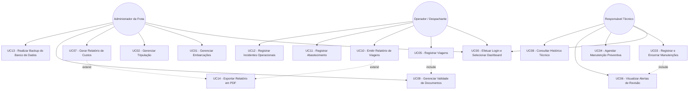

# Protótipos de Interface e Diagramas de Casos de Uso

## 1. Diagrama de Casos de Uso (UML)

O diagrama abaixo ilustra as interações entre os três perfis de usuários e as funcionalidades do sistema:



---

## 2. Protótipos de Interface (Wireframes Textuais)

### 2.1. Tela de Autenticação (Login)
```text
+-------------------------------------------------------------+
|                     GESTAO NAUTICA v1.0                     |
+-------------------------------------------------------------+
|                                                             |
|   Usuario:  [________________________]                      |
|   Senha:    [****************________]                      |
|                                                             |
|   Perfil:   (o) Admin  ( ) Operador  ( ) Técnico            |
|                                                             |
|                  [ Entrar ]    [ Cancelar ]                 |
+-------------------------------------------------------------+
```

### 2.2. Dashboard - Administrador da Frota
```text
+-------------------------------------------------------------+
| GESTAO NAUTICA | Painel Administrador    [Usuario: Vmon-teiro]
+-------------------------------------------------------------+
| [Embarcacoes] [Tripulacao] [Relatorios] [Backup] [Sair]     |
+-------------------------------------------------------------+
| RESUMO DA FROTA                                             |
| +-------------------+  +-------------------+                |
| | Frota Ativa:   12 |  | Doc. Pendentes: 2 |                |
| | Manutencao:     3 |  | Custo Mês: R$ 15k |                |
| +-------------------+  +-------------------+                |
|                                                             |
| ALERTAS DE DOCUMENTACAO (Vencendo em < 15 dias)             |
| - Embarcacao 'Lobo do Mar' - Vistoria vence em: 05 dias     |
| - Vistoria 'Lancha Azul' - Seguro Arrais vence em: 10 dias  |
+-------------------------------------------------------------+
```

### 2.3. Dashboard - Operador / Despachante
```text
+-------------------------------------------------------------+
| GESTAO NAUTICA | Painel Operacional      [Usuario: Operador]|
+-------------------------------------------------------------+
| [Reg. Viagem] [Abastecimento] [Incidentes] [Sair]           |
+-------------------------------------------------------------+
| REGISTRO RAPIDO DE VIAGEM                                   |
| Embarcacao:   [Selecione...        v]                       |
| Comandante:   [Selecione...        v]                       |
| Rota/Destino: [____________________] Passag: [___]           |
| Status Doc:   [ OK - LIBERADO ]                             |
|                                                             |
|                     [ Confirmar Saida ]                     |
+-------------------------------------------------------------+
```

### 2.4. Dashboard - Responsável Técnico pela Manutenção
```text
+-------------------------------------------------------------+
| GESTAO NAUTICA | Painel Tecnico         [Usuario: Tecnico]  |
+-------------------------------------------------------------+
| [Manutencoes] [Agendamentos] [Historico Motor] [Sair]       |
+-------------------------------------------------------------+
| REVISOES PENDENTES / HORIMETRO VENCIDO                      |
| +-----------------+---------------+-----------------------+ |
| | Embarcacao      | Horas Uso     | Proxima Revisao       | |
| +-----------------+---------------+-----------------------+ |
| | Titan II        | 250h          | Troca Oleo (VENCIDA)  | |
| | Nautico I       | 190h          | Filtro (Faltam 10h)   | |
| +-----------------+---------------+-----------------------+ |
|                                                             |
|                   [ Abrir Ordem Servico ]                   |
+-------------------------------------------------------------+
```